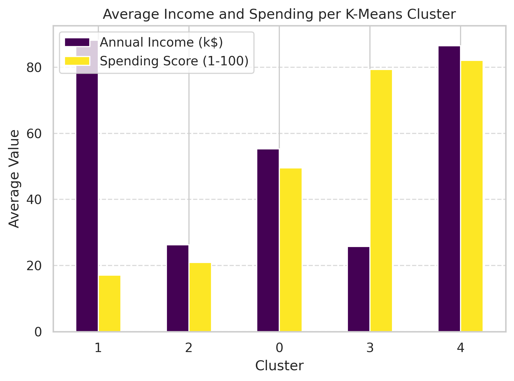
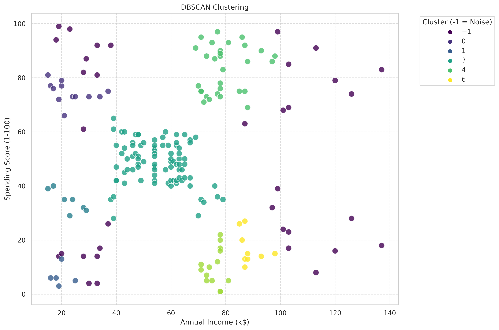

# Customer Segmentation Using Unsupervised Learning

## Overview

This repository hosts a professional machine learning project focused on **customer segmentation** using unsupervised learning techniques on the [Mall Customers dataset](https://www.kaggle.com/datasets/vjchoudhary7/customer-segmentation-tutorial-in-python) from Kaggle. The goal is to identify distinct customer groups based on **Annual Income** and **Spending Score** to enable targeted marketing strategies. The project leverages **K-Means** and **DBSCAN** clustering, optimized with the **Elbow Method** and **Silhouette Score**, and includes advanced data preprocessing and high-quality visualizations.

**Key Objectives**:
- Clean and preprocess the dataset for robust analysis.
- Visualize feature relationships and distributions.
- Apply and optimize clustering algorithms.
- Derive actionable business insights from cluster analysis.

**Dataset**: `Mall_Customers.csv` (included; or can be downloaded from Kaggle).

## Features

- **Exploratory Data Analysis (EDA)**: Correlation heatmaps, gender-segmented pairplots, and scatter plots to uncover patterns.
- **Data Preprocessing**: Handles duplicates, missing values, categorical encoding (e.g., Gender), and feature scaling.
- **Clustering Algorithms**:
  - **K-Means**: Segments customers into 5 optimized clusters with centroid visualization.
  - **DBSCAN**: Detects dense clusters and noise for alternative segmentation.
- **Optimization**: Uses Elbow Method (optimal K=5) and Silhouette Score (~0.55 at K=5) for cluster validation.
- **Visualizations**: High-resolution plots saved in `plots/` (e.g., cluster scatters, optimization curves).
- **Insights**: Computes per-cluster averages to guide marketing strategies.
- **Reproducibility**: Comprehensive notebook with code, documentation, and saved outputs.

## Table of Contents

- [Overview](#overview)
- [Features](#features)
- [Installation](#installation)
- [Usage](#usage)
- [Project Structure](#project-structure)
- [Methodology](#methodology)
- [Results](#results)
- [Future Improvements](#future-improvements)
- [Contributing](#contributing)
- [License](#license)
- [Contact](#contact)
- [Acknowledgments](#acknowledgments)

## Installation

### Prerequisites

- **Python**: 3.8+ ([download](https://www.python.org/downloads/)).
- **Git**: For cloning ([download](https://git-scm.com/downloads)).
- **Jupyter Notebook**: For local execution (`pip install jupyter`).
- **Kaggle Account**: For dataset access and online execution.

### Setup

1. **Clone the Repository**:
   ```bash
   git clone https://github.com/Abdelrahman2610/Customer-Segmentation-Using-Unsupervised-learning.git
   cd Customer-Segmentation-Using-Unsupervised-learning
   ```

2. **Install Dependencies**:
   ```bash
   pip install -r requirements.txt
   ```

3. **Download the Dataset**:
   - Get `Mall_Customers.csv` from [Kaggle](https://www.kaggle.com/datasets/vjchoudhary7/customer-segmentation-tutorial-in-python), or see the folder data for the version worked with

4. **Run on Kaggle** (Alternative):
   - Open the [Kaggle notebook](https://www.kaggle.com/code/abdelrahmansalah2002/customer-segmentation-using-unsupervised-learning).
   - Add the dataset to your Kaggle workspace.
   - Click "Run All" to execute.

### Dependencies
See `requirements.txt`:
```
pandas==2.0.3
numpy==1.24.3
scikit-learn==1.3.0
seaborn==0.12.2
matplotlib==3.7.2
```

## Usage

1. **Open the Notebook**:
   - Locally: `jupyter notebook notebooks/customer-segmentation-using-unsupervised-learning.ipynb`.
   - On Kaggle: Use the provided link.

2. **Run the Notebook**:
   - Update the data path if needed (e.g., `file_path = 'data/Mall_Customers.csv'`).
   - Execute cells to:
     - Load and preprocess data.
     - Perform EDA and save visualizations.
     - Apply clustering and optimization.
     - Analyze clusters for insights.

3. **View Outputs**:
   - Visualizations saved in `plots/` (e.g., `kmeans_clusters.png`).
   - Console outputs include dataset info and cluster metrics.

Example:
```bash
jupyter notebook notebooks/customer-segmentation-using-unsupervised-learning.ipynb
```

## Project Structure

```
Customer-Segmentation-Using-Unsupervised-Learning/
├── notebooks/
│   └── customer-segmentation.ipynb          # Jupyter notebook with code and outputs
├── data/
│   └── Mall_Customers.csv                   # Dataset 
├── plots/
│   ├── kmeans_cluster_summary_bar.png       # K-Means cluster summary
│   ├── kmeans_clusters_with_centroids.png   # K-Means with centroids
│   ├── elbow_method_wcss.png                # Elbow curve
│   ├── silhouette_scores.png                # Silhouette scores
│   ├── dbscan_clustering.png                # DBSCAN clusters
│   ├── scatter_income_vs_spending.png       # Raw data scatter
│   ├── pairplot_features_by_gender.png      # Pairplot by Gender
│   └── kmeans_clustering.png                # K-Means cluster
├── requirements.txt                         # Dependencies
└── README.md                                # This file
```

## Methodology

### Data Loading and Cleaning
- Load `Mall_Customers.csv` with Pandas.
- Remove duplicates and handle missing values.
- Encode categorical variables (e.g., Gender via one-hot).
- Scale numerical features using StandardScaler.

### Data Visualization
- Scatter plots for raw data (Annual Income vs. Spending Score).
- Pairplots by Gender for feature distributions.
- Correlation heatmaps for relationships.
- Plots saved to `plots/` with inline display.

### Clustering
- **K-Means**: Fit on scaled data with 5 clusters; visualize centroids.
- **DBSCAN**: Tune parameters to identify dense clusters and noise.

### Evaluation
- **Elbow Method**: Identify K=5 via WSS plot.
- **Silhouette Score**: Peak at ~0.55 for K=5.
- Compare K-Means and DBSCAN for robustness.

### Outputs
- Cluster assignments added to the dataset.
- Per-cluster averages computed for insights.
- Visualizations exported as PNGs.

## Results

### K-Means Clustering
- **Optimal Clusters**: 5 (Elbow Method, Silhouette Score ~0.55).
- **Cluster Averages**:

| Cluster | Avg. Annual Income (k$) | Avg. Spending Score (1-100) | Description |
|---------|-------------------------|-----------------------------|-------------|
| 0       | 55                      | 49                          | Medium income, medium spending – Balanced; general promotions. |
| 1       | 86                      | 18                          | High income, low spending – Affluent savers; luxury discounts. |
| 2       | 26                      | 20                          | Low income, low spending – Budget-conscious; value deals. |
| 3       | 26                      | 79                          | Low income, high spending – Impulse buyers; affordable luxuries. |
| 4       | 88                      | 82                          | High income, high spending – Premium; loyalty programs. |



### DBSCAN Clustering
- **Clusters**: 7 + noise.
- **Averages**:

| Cluster | Avg. Annual Income (k$) | Avg. Spending Score (1-100) |
|---------|-------------------------|-----------------------------|
| -1 (Noise) | Varies               | Varies                      |
| 0       | 23.17                   | 74.58                       |
| 1       | 19.60                   | 6.60                        |
| 2       | 22.43                   | 34.43                       |
| 3       | 55.23                   | 48.58                       |
| 4       | 79.53                   | 83.13                       |
| 5       | 75.93                   | 10.07                       |
| 6       | 88.78                   | 17.00                       |



### Insights
- Clear customer segments enable targeted strategies.
- Visualizations show distinct clusters; pairplots highlight gender trends.
- Limitations: Two-feature focus; small dataset.

## Future Improvements

- Explore Hierarchical Clustering or Gaussian Mixture Models.
- Include Age or Gender in clustering for richer segments.
- Develop an interactive dashboard with Streamlit or Dash.
- Scale to larger datasets or real-time pipelines.

## Contributing

Contributions are welcome! Steps:
1. Fork the repository.
2. Create a branch: `git checkout -b feature/your-feature`.
3. Commit changes: `git commit -m "Add feature"`.
4. Push: `git push origin feature/your-feature`.
5. Open a Pull Request.

## Contact

- **Author**: Abdelrahman Mohamed Salah
- **GitHub**: [Abdelrahman2610](https://github.com/Abdelrahman2610)
- **Kaggle**: [abdelrahmansalah2002](https://www.kaggle.com/abdelrahmansalah2002)

## Acknowledgments

- Dataset: [Kaggle Mall Customers](https://www.kaggle.com/datasets/vjchoudhary7/customer-segmentation-tutorial-in-python).
- Libraries: Pandas, Scikit-learn, Matplotlib, Seaborn.
- Community tutorials on unsupervised learning.
